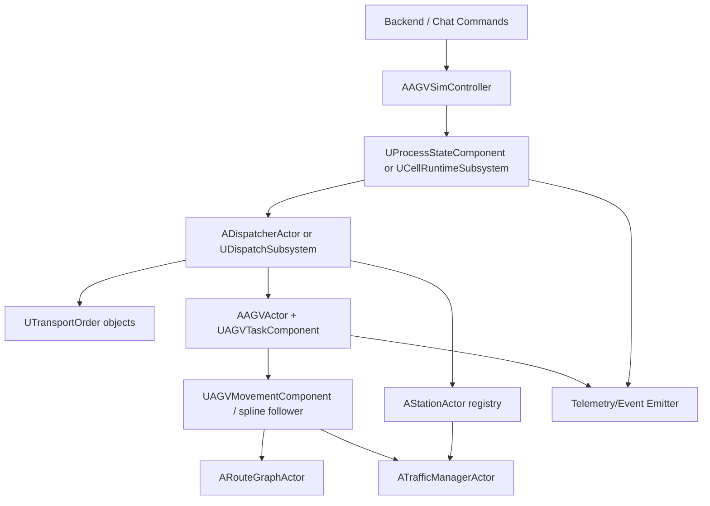

# AGV Production Enhancement Plan

**Project:** VCORE UE5 AGV Cell Simulation  
**Date:** 2026-06-11  
**Status:** Phase 1-2 code-complete; Phase 3 StateTree control gate code-complete; StateTree asset authoring remains  
**Scope:** Upgrade the current demo AGV loop into a more production-like digital-twin runtime.

## 1. Current Runtime Assessment

The current AGV runtime is a useful demo scaffold, but it is not yet a production dispatch model.

Current behavior:

- `AAGVSimController` spawns `AGV-1`, `AGV-2`, etc. from `ActiveParams.AgvCount`.
- Each AGV is bound to an authored `AAGVPathActor` spline by index.
- `ALoadingDockActor` immediately assigns a delivery cycle to each AGV at run start.
- When an AGV unloads, `ALoadingDockActor::CompleteTask` immediately assigns another task.
- `AAGVActor` advances along the spline every tick using procedural transform updates.
- Pickup and dropoff are fixed path ratios, currently `0.22` and `0.72`.
- Loading and unloading are fixed-duration local action states, currently `1.0` second each.
- `/agv/command` maps `station_id` to a deterministic path ratio instead of resolving an authored station transform.
- `AIntersectionManager` models one shared intersection segment using FIFO entry.
- Telemetry emits AGV world position and process KPIs, but not logical node/edge/station occupancy.

Conclusion: state transitions are not purely timer-driven, because movement states transition when the AGV crosses spline checkpoints. However, the task model, station model, load model, and command routing are temporary/demo-level.

## 2. Target Production-Like Model

The target should be a task-driven AGV cell where runtime behavior is based on explicit operational objects:

- Stations with authored physical location, docking pose, capacity, accessibility, and process capability.
- Orders and transport jobs with source, destination, load type, priority, due time, and lifecycle state.
- Loads with identity, current holder/location, compatibility, and handling constraints.
- A dispatcher that assigns tasks to AGVs based on availability, route distance, battery, station readiness, route reservations, and priority.
- A route/traffic layer that manages lanes, graph nodes, intersections, reservations, blocked segments, and ETA.
- Telemetry that reports both world coordinates and semantic production state.

The upgraded system should still support the current demo UI and chat commands, but the commands should operate on real task/station/load abstractions instead of direct path-ratio retargeting.


## 3. Additional Actors and Objects Needed

Yes, another actor/object layer is needed besides `AAGVActor`. The current AGV actor is carrying too much domain meaning through hardcoded path ratios and local flags. Production-like behavior needs explicit runtime entities.

### 3.1 New Actors

| Actor | Purpose | Notes |
|---|---|---|
| `AStationActor` | Authored physical station in the UE level | Holds `StationId`, station type, docking transform, capacity, zone, tags, readiness, accessibility. Replaces station-id-to-ratio mapping. |
| `ARouteGraphActor` or `ACellRouteNetworkActor` | Owns lane graph and route segments | Can start simple: nodes, edges, segment IDs, spline references, speed limits, directionality. |
| `ATrafficManagerActor` | Owns reservations and intersection/segment arbitration | Supersedes single `AIntersectionManager` as the cell grows. |
| `ADispatcherActor` or `UDispatchSubsystem` | Assigns jobs to AGVs | Actor is easier to inspect in level; subsystem is cleaner if it should be global and non-visual. |

### 3.2 New UObjects / Components

| Object | Purpose | Notes |
|---|---|---|
| `UTransportOrder` | Production job/order lifecycle | Prefer UObject or replicated data asset-like runtime object, not an Actor unless it needs world presence. |
| `ULoadObject` | Pallet/load/container identity and lifecycle | UObject first; use an Actor only if visible physical loads are needed. |
| `UAGVTaskComponent` | AGV task execution state | Keeps `AAGVActor` focused on vehicle representation and movement. |
| `UAGVMovementComponent` or enhanced spline follower | Movement abstraction | Lets BT or State Tree call the same movement API later. |
| `UStationStateComponent` | Station reservation/readiness/processing state | State Tree candidate if station lifecycle grows. |
| `UProcessStateComponent` or `UCellRuntimeSubsystem` | Cell/process lifecycle | Holds process-level state and produces process telemetry. |

### 3.3 Actor Rule of Thumb

Use an Actor when the object needs a transform, level authoring, collision, visualization, or camera/debug selection.

Use UObject/component/subsystem when the object is mostly data, lifecycle, assignment, or orchestration.

Therefore:

- Stations and route networks should be Actors because they are spatial and authored in the level.
- Orders and loads should start as UObjects because they are operational records.
- Loads can later gain optional visual Actors if the demo needs visible pallets/containers.

## 4. Proposed Architecture

### 4.1 Runtime Ownership



### 4.2 State Ownership

| State | Owner | Persistence |
|---|---|---|
| Run state | Process component/subsystem | Backend run DB plus UE live state |
| AGV lifecycle | AGV task component with State Tree | UE live state, telemetry projection |
| Movement progress | Movement component | UE live only, telemetry projection |
| Station readiness/reservation | Station actor/component | UE live, optionally backend/control-server sync |
| Order/job lifecycle | `UTransportOrder` plus backend command/run DB | Backend canonical, UE execution mirror |
| Load lifecycle | `ULoadObject` | Backend optional, UE execution mirror |

## 5. Implementation Phases

### Phase 1: Domain Model Without AI Rewrite

Goal: remove hardcoded station ratios and immediate infinite task assignment.

Tasks:

1. Add `AStationActor`.
2. Add `UTransportOrder` and `ULoadObject`.
3. Add a station registry in `AAGVSimController` or a new `UCellRuntimeSubsystem`.
4. Change `/agv/command` to resolve `station_id` to `AStationActor` instead of `StationAnchorRatio`.
5. Replace `LoadingDockActor::AssignNextTask` with dispatcher-created orders.
6. Keep existing spline movement and enum states for this phase.

Acceptance:

- `station_id` maps to authored world stations.
- A command creates or selects a transport order.
- AGV telemetry includes `task_id`, `target_station_id`, `current_station_id`, and `load_id` when applicable.
- No direct path-ratio station mapping remains in command execution.

### Phase 2: Dispatcher and Reservation Layer

Goal: make AGV selection and route conflicts production-like.

Tasks:

1. Add `ADispatcherActor` or `UDispatchSubsystem`.
2. Add `ATrafficManagerActor` with segment/intersection reservations.
3. Replace "first non-collision AGV" selection with a scoring function:
   - availability,
   - distance/ETA,
   - battery,
   - current assignment,
   - station accessibility,
   - route availability.
4. Expand telemetry with route segment and reservation state.
5. Keep `AIntersectionManager` only as a compatibility wrapper or remove it after migration.

Acceptance:

- If two AGVs target conflicting segments, one reserves and the other waits with a reason.
- AGV selection is explainable in logs/telemetry.
- Bottleneck events include segment/station context, not only `INTERSECTION_X`.

Implementation status, 2026-06-11:

- Added `ADispatcherActor` with deterministic candidate scoring across availability, ETA/distance, battery, assignment state, station readiness/accessibility, and route availability.
- Added `ATrafficManagerActor` with exclusive segment reservations, FIFO waiting, per-segment wait tracking, queue snapshots, and blocked-segment counts.
- Updated `AAGVActor` to reserve the default `INTERSECTION_X` segment through `ATrafficManagerActor` while keeping `AIntersectionManager` as a compatibility fallback.
- Updated `/agv/command` routing in `AAGVSimController` to select AGVs via dispatcher scoring and emit `dispatch_reason`, `dispatch_score`, `route_segment_id`, and `eta_seconds` on `robot.moving`.
- Updated station discovery logging and `/sim/status` to verify editor-authored stations from `AuthoredStations` or world scan. `/sim/status` now includes `station_count`, `stations[]`, `dispatcher_ready`, `traffic_manager_ready`, `blocked_segments`, and `avg_route_wait_time`.
- Expanded AGV telemetry with `current_segment_id`, `reservation_state`, `route_wait_seconds`, and station ETA from the traffic/dispatch layer.
- Expanded final runtime KPIs with traffic-layer `avg_route_wait_time` and `blocked_segments`.

Build note:

- Verified on 2026-06-11 with UE 5.7:
  `Build.bat VCOREEditor Win64 Development -Project=...\VCORE.uproject -WaitMutex`
- Result: succeeded. The remaining Phase 2 work is editor/PIE validation, not C++ compilation.

### Phase 3: State Tree for Lifecycle

Goal: move lifecycle state out of ad hoc enum transitions.

Tasks:

1. Add `UAGVTaskComponent`.
2. Add State Tree asset or C++ State Tree schema for AGV task lifecycle.
3. Add State Tree for order lifecycle or encode the first version in `UTransportOrder`.
4. Add State Tree or state component for process run lifecycle.
5. Adapt existing transition events to emit from state transition callbacks.

Acceptance:

- AGV high-level states are driven by State Tree or a State Tree-ready component.
- Order lifecycle has terminal states and failure reasons.
- Process status can report `running`, `paused`, `degraded`, `faulted`, and `completing` deterministically.

Implementation status, 2026-06-11:

- Added `UAGVTaskComponent` as a StateTree-ready lifecycle facade for AGVs, with an optional `LifecycleStateTree` asset reference, lifecycle transition delegate, current order tracking, target station tracking, timestamps, and failure reason storage.
- Attached `UAGVTaskComponent` to `AAGVActor` and mirrored existing enum transitions into task lifecycle states without changing spline movement behavior.
- Extended AGV telemetry with `task_lifecycle_state` and `task_failure_reason`.
- Extended `UTransportOrder` with `FailureReason` and `MarkFailed(reason)` so terminal failures are explainable.
- Preserved `task_id`, `order_id`, and `load_id` before command completion bookkeeping moves orders out of the active list.

Build note:

- Verified on 2026-06-11 with UE 5.7:
  `Build.bat VCOREEditor Win64 Development -Project=...\VCORE.uproject -WaitMutex`
- Result: succeeded after removing an UnrealHeaderTool-incompatible default `FString()` parameter from `UAGVTaskComponent::TransitionTo`.
- Fixed the AGV unload completion path so the non-looping loading dock no longer leaves AGVs in `Unloading`, and station-command completion no longer leaves stale order telemetry on idle AGVs.
- `AAGVActor` now owns a `UStateTreeComponent` named `TaskStateTreeComponent`.
- `UAGVTaskComponent` binds to that runtime StateTree component, starts/stops it per run, and sends native StateTree events for control operations and lifecycle transitions.
- AGV control operations are now gated by StateTree readiness when `bRequireStateTreeForControl` is enabled.
- `/agv/command` now releases station reservations and reports `state_tree_control_rejected` if the AGV's StateTree gate rejects a station move.
- AGV telemetry includes `state_tree_control_ready` and `state_tree_last_operation` for PIE/debug validation.
- Build verified on 2026-06-11 with UE 5.7 after the StateTree control-gate integration.
- The remaining Phase 3 work is StateTree asset authoring/configuration. Without assigning a valid `LifecycleStateTree`, strict AGV control will reject operations by design.

### Phase 4: Optional BT/Nav Execution Layer

Goal: introduce tactical AGV AI only when route decisions require it.

Tasks:

1. Add `AAGVAIController`.
2. Enable AI possession for AGVs.
3. Add Blackboard keys:
   - `CurrentOrder`,
   - `TargetStation`,
   - `TargetRoute`,
   - `CurrentSegment`,
   - `ReservationStatus`,
   - `BatteryState`,
   - `FaultState`.
4. Add BT tasks for reserve, move, dock, load, unload, charge, and recover.
5. Keep State Tree as lifecycle authority, or explicitly define BT as execution authority with State Tree as process/order authority.

Acceptance:

- BT tasks are thin execution units.
- State Tree and BT do not compete for the same transition authority.
- AGV can reroute or wait based on traffic manager feedback.

## 6. Data and Telemetry Contract Changes

Extend AGV telemetry:

```json
{
  "kind": "agv",
  "cell_id": "cell_demo",
  "agv_id": "AGV-1",
  "state": "MOVING_TO_PICKUP",
  "task_id": "task_123",
  "order_id": "order_123",
  "load_id": "load_123",
  "current_station_id": 1,
  "target_station_id": 2,
  "current_segment_id": "seg_A_01",
  "reservation_state": "reserved",
  "eta_seconds": 14.2,
  "battery": 91.0,
  "position": {"x": 0, "y": 0, "z": 0}
}
```

Extend process telemetry:

```json
{
  "kind": "process",
  "cell_id": "cell_demo",
  "state": "running",
  "active_orders": 4,
  "queued_orders": 2,
  "completed_orders": 12,
  "blocked_segments": 1,
  "station_utilization": {"1": 0.42, "2": 0.77}
}
```

## 7. Testing Strategy

### C++ / UE Automation

- Station registry resolves valid IDs and rejects unknown IDs.
- Dispatcher chooses the best AGV based on deterministic scoring.
- Order lifecycle transitions to completed/failure states correctly.
- Traffic manager grants exclusive segment reservations.
- AGV task component emits expected state transitions.

### Integration

- `/agv/command` creates/selects an order and sends an AGV to the authored station.
- `/sim/start` starts process state and creates workload according to scenario parameters.
- Telemetry stream includes semantic task/station/load fields.
- Existing chat flow still receives `robot.moving` and `robot.command.completed`.

### PIE / Visual

- Station actors are visible/selectable and aligned with docking poses.
- AGVs stop at station docking transforms.
- Multi-AGV conflict produces visible waiting and telemetry reason.
- Camera switching still works for AGVs and zones.

## 7.1 Required Editor Work

1. Open `VCORE.uproject` with UE 5.7 so `PixelStreaming2`, `StateTree`, `GameplayStateTree`, and `NarshaMCP` resolve from the intended engine/project setup.
2. Open the AGV demo map that contains the `AAGVSimController`.
3. Select the `AAGVSimController` actor and verify:
   - `AGVActorClass` points to the intended AGV Blueprint child, if one is used.
   - `AuthoredPaths` contains at least as many `AAGVPathActor` entries as the largest AGV count you plan to test.
   - `AuthoredStations` contains the authored `AStationActor` entries you want commands to target. If left empty, runtime fallback stations are created only as a compatibility aid.
4. Place or verify `AStationActor` instances in the level:
   - Set unique `StationId` values matching expected `/agv/command` `station_id` values.
   - Move each actor/docking pose to the desired physical stopping point.
   - Set `StationKind`, `ZoneId`, `CapabilityTags`, `bReady`, and `bAccessible` for dispatch scoring.
5. PIE validation:
   - Start a sim with multiple AGVs.
   - Call `/sim/status` and confirm `station_count`, `stations[]`, `dispatcher_ready`, and `traffic_manager_ready`.
   - Send `/agv/command` with a known `station_id` and confirm `robot.moving` includes `task_id`, `order_id`, `load_id`, `dispatch_reason`, `dispatch_score`, `route_segment_id`, and `eta_seconds`.
   - Confirm the AGV stops at the authored station docking pose and emits `robot.command.completed`.
   - Run a multi-AGV crossing scenario and confirm one AGV waits with `reservation_state="waiting"` and route wait telemetry.
6. For strict Phase 3 signoff, author and assign an AGV lifecycle StateTree:
   - Create an AGV lifecycle StateTree asset, for example `ST_AGV_TaskLifecycle`, using `StateTreeComponentSchema`.
   - Model states matching `EAGVTaskLifecycleState`: `Offline`, `Idle`, `Assigned`, `MovingToPickup`, `Loading`, `MovingToDropoff`, `Unloading`, `MovingToStation`, `WaitingForRoute`, `Completed`, `Failed`, and `CollisionStopped`.
   - Add transitions driven by these native events:
     `VCORE.AGV.Control.StartRun`, `VCORE.AGV.Control.StopRun`, `VCORE.AGV.Control.AssignOrder`, `VCORE.AGV.Control.CompleteTask`, `VCORE.AGV.Control.FailTask`,
     plus lifecycle events under `VCORE.AGV.State.*`.
   - Assign the asset to the AGV Blueprint's `TaskComponent -> LifecycleStateTree`.
   - Keep `TaskComponent -> bRequireStateTreeForControl` enabled for production-like validation.
   - PIE check that spawned AGVs report `state_tree_control_ready=true`, commands do not return `state_tree_control_rejected`, and lifecycle telemetry still matches the visible AGV state.

## 8. Risks and Mitigations

| Risk | Impact | Mitigation |
|---|---|---|
| Overbuilding BT before the domain model is stable | High churn | Delay BT until route execution needs it. |
| State Tree and BT both trying to own AGV state | Conflicting transitions | State Tree owns lifecycle; BT owns tactical execution only. |
| Too many Actors for data-only concepts | Performance and complexity | Keep orders/loads as UObjects first. |
| Backend and UE disagree on station/order state | Operator confusion | Define backend as canonical command/order history and UE as live execution authority. |
| Existing demo UI breaks due to telemetry changes | Demo regression | Add fields without removing current fields. |
| `AGVSimController` grows further | Architecture debt | Extract dispatcher, process state, telemetry, and command routing boundaries as part of the migration. |

## 9. Plan Review Score

This plan was reviewed against the local UE plan-review rubric.

| Category | Score |
|---|---:|
| Completeness | 9.5/10 |
| Accuracy | 9.0/10 |
| Feasibility | 9.5/10 |
| Testing | 9.0/10 |
| Risk | 9.5/10 |
| UE Architecture | 9.5/10 |

Weighted average: **9.33/10**.

The main remaining gap is implementation-level specificity for concrete State Tree asset names and schemas. That should be resolved after Phase 1 introduces stations, orders, and task components, because those classes define the stable context data that State Tree should operate on.

## 10. Final Recommendation

1. Add production domain objects first: stations, orders, loads, dispatcher, and traffic manager.
2. Use State Tree for lifecycle orchestration once those objects exist.
3. Keep AGV movement on the current spline follower while adding a clean movement/task component API.
4. Add actors for spatial entities, especially stations and route networks. Keep orders and loads as UObjects unless they need physical visualization.
