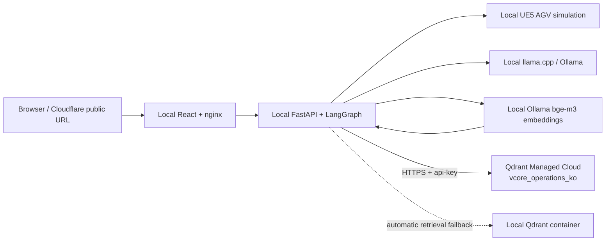

# Qdrant Cloud deployment

> **Deployment status (verified 2026-06-21):** live on Qdrant Managed Cloud in GCP
> `australia-southeast1`. The `vcore_operations_ko` collection is green with 16 points,
> 1024-dimensional Cosine vectors, and the collision SOP ranks first in the live acceptance query.
> The same backend process was verified against cloud-primary and forced local-failback paths.

## Decision

VCORE moves the `vcore_operations_ko` vector collection to **Qdrant Managed Cloud** while the UE5
simulation, FastAPI/LangGraph backend, Ollama `bge-m3` embeddings, and llama.cpp chat model remain on
the demo workstation. This is the smallest managed-cloud cut that exercises a real AI-platform
component without putting the latency-sensitive simulation control loop or the trained local model
behind a paid endpoint.

Qdrant Cloud was chosen over a managed model endpoint because the current corpus and adapter already
use Qdrant's REST contract. The Free Tier is appropriate for this portfolio workload: one node,
0.5 vCPU, 1 GB RAM, and 4 GB disk. It has no production SLA and an inactive free cluster may be
suspended after one week and deleted after four weeks, so this topology is a demonstrable deployment,
not a production availability claim.

Official references:

- [Qdrant Cloud pricing](https://qdrant.tech/pricing/)
- [Create a Qdrant Cloud cluster](https://qdrant.tech/documentation/cloud/create-cluster/)
- [Qdrant Cloud quickstart and API-key authentication](https://qdrant.tech/documentation/cloud-quickstart/)

## Topology



Only corpus chunks, embeddings, and retrieval metadata cross the cloud boundary. Chat messages,
simulation commands, raw UE telemetry, prompts, and model inference remain local. The cloud API key
is server-side only and must never be placed in the React/Vite environment.

## One-time cloud setup

1. Create a Free Tier cluster in the [Qdrant Cloud console](https://cloud.qdrant.io/).
2. Copy the HTTPS cluster URL and the generated database API key. The key is shown once.
3. Create `web/.env` from `web/.env.example` and set:

   ```env
   RAG_ENABLED=true
   QDRANT_URL=https://<cluster-id>.<region>.<provider>.cloud.qdrant.io
   QDRANT_API_KEY=<database-api-key>
   QDRANT_FALLBACK_URL=http://qdrant:6333
   RAG_COLLECTION=vcore_operations_ko
   EMBED_BASE_URL=http://ollama:11434
   RAG_EMBED_MODEL=bge-m3
   ```

4. Seed the cloud collection from the host, keeping the secret in the current shell rather than a
   command-line argument:

   ```powershell
   $env:QDRANT_URL = 'https://<cluster-host>'
   $env:QDRANT_API_KEY = '<database-api-key>'
   $env:EMBED_BASE_URL = 'http://localhost:11434'
   C:/Users/PC/anaconda3/python.exe web/services/data-seeder/scripts/build_qdrant_seed.py --recreate
   ```

5. Verify the collection without printing the key:

   ```powershell
   $headers = @{ 'api-key' = $env:QDRANT_API_KEY }
   Invoke-RestMethod -Headers $headers "$env:QDRANT_URL/collections/vcore_operations_ko"
   ```

   Then run the repository verifier. It checks HTTPS/auth connectivity, green collection state,
   1024-dimensional cosine configuration, point count, and the expected collision SOP ranking; its
   JSON output never includes the API key:

   ```powershell
   C:/Users/PC/anaconda3/python.exe web/services/data-seeder/scripts/verify_qdrant_deployment.py
   ```

6. Start the normal stack. The backend queries cloud first. If the cloud request fails and
   `QDRANT_FALLBACK_URL` is set, retrieval retries the local Qdrant container without forwarding the
   cloud API key.

## Offline demo profile

For a fully offline demo, leave `QDRANT_API_KEY` and `QDRANT_FALLBACK_URL` empty and restore the
default URL:

```env
RAG_ENABLED=true
QDRANT_URL=http://qdrant:6333
QDRANT_API_KEY=
QDRANT_FALLBACK_URL=
```

Seed local Qdrant with the same ingestion command and no `QDRANT_API_KEY`. Both deployments use the
same 1024-dimensional `bge-m3` collection, point IDs, payload schema, filters, reranker, GraphRAG
router, and PA.4 evaluation harness.

## Verification checklist

- `verify_qdrant_deployment.py` exits zero and reports `"verified": true`.
- Seeder reports the expected corpus point count and a second run updates the same UUID5 point IDs.
- A collision-response query ranks `sop_collision_001` first.
- Backend RAG tests pass with secrets absent.
- Stopping cloud access still produces grounded results from local Qdrant when fallback is enabled.
- Logs and checked-in files contain neither the API key nor a populated `.env`.

## Portfolio narrative

> VCORE is a hybrid edge/cloud AI twin. UE5 simulation, the fine-tuned local tool router, and
> multilingual embedding inference stay on the workstation for deterministic low-latency control.
> The enterprise knowledge index runs as a managed Qdrant Cloud service over authenticated HTTPS,
> with the same corpus mirrored to local Qdrant for an offline-safe live demo. LangGraph combines
> managed vector retrieval with the locally built AGV ontology/GraphRAG path before issuing guarded,
> observable recommendations.

The live demo should show the Qdrant Cloud collection dashboard, then run one cited SOP query and one
multi-hop station/capability query. Disconnecting or overriding the cloud URL demonstrates that the
same backend fails back to the local mirror without changing application code.
