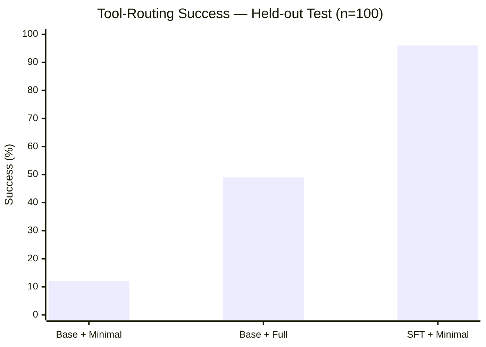
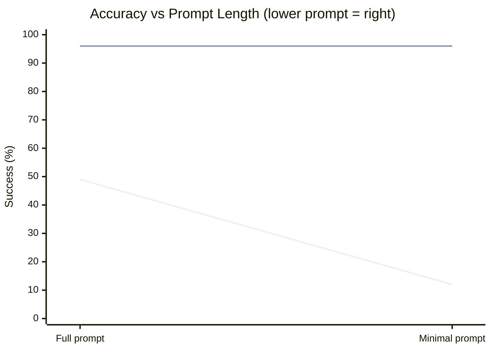
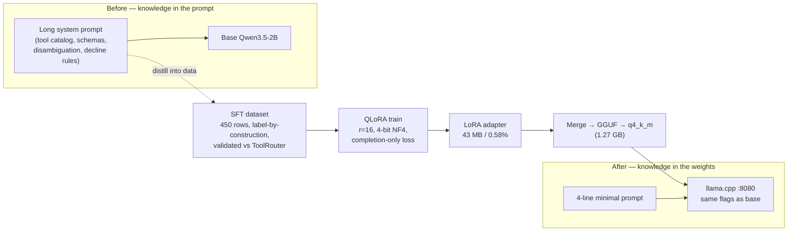

# Prompt Distillation via QLoRA — Internalizing Tool-Routing into a 2B Control Agent

> **One-line:** Replaced a long, hand-tuned system prompt with a QLoRA-fine-tuned 2B model so
> an on-premises UE5 process-control agent routes tool calls correctly under a 4-line prompt —
> **49% → 96% task success** while *removing* the prompt the accuracy used to depend on.
>
> Author: V-CORE LLM track · Date: 2026-06-11 · Status: shipped (Phase 3 complete)

---

## 1. Project Background

### 1.1 The system — an AI-twin for industrial operations
**V-CORE** is an AI-twin platform that pre-verifies industrial operational strategies. A
**UE5 (Unreal Engine 5)** scene simulates an **AGV (Automated Guided Vehicle) cell** —
stations, transport routes, collisions, throughput — while a web stack lets an operator drive
and inspect that simulation in natural language.

The conversational layer is a **LangGraph multi-agent chatbot** (FastAPI, DDD/hexagonal). The
operator types a command ("send the AGV to the loading area", "run a sim with 6 AGVs until
throughput ≥ 80"); the agent must translate it into a **structured control command** that the
UE5 HTTP server on `:7777` can execute, and stream telemetry/KPIs back.

### 1.2 The control structure — Tool Calling
The agent does not free-form text its way into the simulator. It selects exactly **one of 9
typed tools** and emits a strict JSON object the gateway parses:

```json
{"name": "move_to_station", "arguments": {"station_id": 3}}
```

| Tool | Required | Optional |
|---|---|---|
| `move_to_station` / `run_station_task` / `inspect_station` | `station_id:int` | `priority` (run only) |
| `cancel_command` | `command_id:str` | — |
| `start_simulation` | — | `agv_count`, `speed_multiplier`, `simulation_name`, `acceptance[]` |
| `stop/pause/resume_simulation` | — | — |
| `set_sim_speed` | `speed_multiplier:num` | — |

Two non-tool terminal states keep the agent safe:
- `{"name":"none","arguments":{}}` — out-of-scope / chit-chat → **don't act**.
- `{"name":"clarify","arguments":{"message":"…"}}` — missing/ambiguous/invalid input → **ask, don't guess**.

The hardest cases are **disambiguation** (verb → tool: "check" → `inspect`, "work" → `run`,
"go" → `move`) and **KPI acceptance** (extracting a nested `acceptance[]` array of
`{metric, comparator, threshold}` triples for `start_simulation`).

### 1.3 The inference environment — on-premises llama.cpp
For data-control and cost reasons the system runs **fully on-premises** — no hosted LLM API.
The production model is **Qwen3.5-2B** (Ollama tag `qwen3.5:2b`; a Gated-DeltaNet *hybrid
linear-attention* architecture), served by a **CUDA `llama.cpp` build (9559, `715b86a36`)** on
`:8080` with **reasoning disabled** (`--reasoning off`, `num_ctx` small). Reasoning-off is the
single biggest latency lever — it took the disambiguation path from ~11.7s to ~2.4s per call.
This on-prem, small-model, reasoning-off regime is the fixed stage on which every decision below
was made: there is no "just use a bigger model / longer context" escape hatch.

---

## 2. Problem Definition

### 2.1 Routing accuracy lived in the prompt, not the model
Production accuracy (94% KPI acceptance, 91.7% disambiguation on the v2 suite) was achieved by a
**long, carefully hand-tuned system prompt** (`tool_planning_system.txt`) plus serving
optimization. The prompt carried the tool catalog, argument schemas, disambiguation rules,
decline policy, and worked examples. **The competence was in the prompt string, not in the
weights.**

### 2.2 Why that is a liability
- **Maintainability.** Every new tool, renamed argument, or disambiguation edge case meant
  editing a fragile multi-section prompt and re-validating the whole thing. Prompt edits have no
  type system, no tests beyond the eval suite, and silent cross-interactions.
- **Scalability.** The prompt grows linearly with the tool surface. A 9-tool catalog is already
  long; a realistic plant has dozens of tools/stations. The prompt becomes the bottleneck.
- **Inference cost & latency.** Every single turn re-encodes the entire long prompt as input
  tokens — on a 2B model served on one consumer GPU, prompt tokens are a real share of the
  per-call budget, paid forever, on every request.
- **Brittleness.** A long prompt is a global coupling point: one rule competes with another, and
  the model's adherence degrades as the instruction stack deepens — especially with reasoning
  *off*, where the model can't "think through" the rules.

### 2.3 The structural limit
Prompt engineering optimizes **how you ask**. But the underlying question was **whether the
model knows the domain at all**. As long as routing rules are re-stated at inference time, you
are renting competence by the token instead of owning it. That ceiling is what motivated a
weight-level intervention.

---

## 3. Hypothesis

> **H1 — Distillation is possible.** Tool-routing rules currently expressed in the prompt can be
> moved *into the model weights* via supervised fine-tuning, so the model routes correctly even
> when the rules are removed from the prompt.
>
> **H2 — QLoRA suffices.** A parameter-efficient **QLoRA** fine-tune of the *exact production
> base* can, under a **4-line minimal prompt**, match or exceed the *original long-prompt*
> accuracy — turning a long prompt into a short one with no loss (a "prompt distillation").

This reframes the success metric. The goal is **not** "beat the production number" (production
was already good). The goal is to **prove the long prompt is no longer load-bearing** — that the
same behavior survives when you delete the prompt that produced it. If true, the prompt becomes
documentation instead of machinery.

### The minimal prompt (frozen for the whole experiment)
```text
You are the V-CORE tool planner.
Given a user command, select exactly one tool and produce valid JSON arguments.
Do not explain. Do not invent missing IDs. If required information is missing,
return the clarify tool instead of guessing.
Output JSON only: {"name": <tool>, "arguments": {...}}.
```

---

## 4. Experimental Design

### 4.1 Dataset construction — label-by-construction, grounded on real contracts
**450 rows, stratified: Train 300 / Val 50 / Test 100.** Two design rules made the data
trustworthy:

1. **Grounded on production truth.** Labels target the **9 real tools in
   `app/tools/contracts.py`**, not illustrative names. Every label JSON is validated against the
   **live `ToolRouter.validate(check_ranges=True)`** — 450/450 valid. Decline rows use the
   gateway's real `none`/`clarify` sentinels.
2. **Label-by-construction.** Rows are generated by template + slot expansion (a generator,
   `build_sft_dataset.py`), so the label is correct *by how the row was built*, not by
   post-hoc annotation. This eliminates labeling noise.

**Augmentation (133 v2 cases → 450).** Variation banks expand each intent across:
- **Verbs** (ko+en): send/move/dispatch/보내/이동 → `move`; run/work/execute/작업/돌려 → `run`;
  check/inspect/확인/점검 → `inspect`; start/stop/pause/resume families.
- **Station forms:** `S{n}`, `station {n}`, `{n}번 스테이션`, named aliases
  (`loading area`→1, `warehouse`→10, `shipping area`→12).
- **Languages:** Korean + English, balanced (~54% ko / 46% en).

**Category mix over-weights the two hardest targets** — `disambiguation` (90 rows) and
`kpi_acceptance` (81 rows) — plus core routing, lifecycle, and decline-discipline categories.

### 4.2 Anti-leakage discipline
The **test set is held out with zero prompt-string overlap** against train/val (asserted at
build time: 450/450 unique prompts). Because augmentation can produce surface-similar strings,
this assertion is the guardrail that keeps the 96% from being memorization of seen strings
(see interview Q on leakage).

### 4.3 Prompt → dataset conversion (the distillation encoding)
Each row becomes a chat sample that *teaches the minimal-prompt behavior*:
- **system** = the frozen **minimal** prompt (not the long one).
- **user** = the command.
- **assistant** = the label JSON.

Crucially, **only the completion tokens contribute to the loss** (prompt tokens masked to
`-100`). The model is trained to *produce the JSON*, not to reproduce the prompt — this is what
forces the routing rule into the weights rather than into a learned echo of instructions.

### 4.4 QLoRA training setup
| Knob | Value | Why |
|---|---|---|
| Base | `Qwen/Qwen3.5-2B` (= `qwen3.5:2b`) | **identical to production** → before/after is valid |
| Quantization | 4-bit NF4 + double-quant | fits a 2B + optimizer in 8 GB VRAM |
| LoRA | r=16, α=32, dropout=0.05 | small, regularized adapter on a narrow task |
| Target modules | `q,k,v,o,gate,up,down_proj` | attention + MLP projections |
| Optimizer | `paged_adamw_8bit`, lr 2e-4 cosine, warmup 0.03 | memory-frugal, stable |
| Schedule | 3 epochs, eff. batch 16 (8×2), max_seq 1024, bf16, grad-checkpoint | — |
| Trainable | **10.9M params (0.58%)** | base frozen; adapter is the only delta |
| Hardware/time | RTX 4060 Ti 8 GB, **~6.8 min** | cheap to reproduce |

**Result:** monotonic convergence, **eval_loss 0.0315 → 0.0037 → 0.0029**.

### 4.5 Artifact pipeline — adapter → merged → GGUF → quantized
The base weights are **never modified**; the fine-tune is a separate artifact at every stage:

```
Qwen3.5-2B (frozen)
      │  QLoRA train (completion-only loss)
      ▼
LoRA adapter  (43 MB, 10.9M params)  ──►  merged fp16 HF model (3.76 GB)
                                                │  convert_hf_to_gguf.py
                                                ▼
                                          GGUF f16 (3.78 GB)
                                                │  llama-quantize q4_k_m
                                                ▼
                                   vcore-toolrouter.gguf (1.27 GB)  ──► llama.cpp :8080
```

### 4.6 Deployment — same server, same flags as the base
The SFT model is served by the **same llama.cpp build, same flags** as the production base
(`-ngl 99 -c 4096 --jinja --reasoning off`). Identical serving is what makes the comparison
apples-to-apples — the only variables are *weights* and *prompt*, never the runtime.

> **Engineering note (real friction, real decisions):** getting the SFT weights onto the *same*
> bleeding-edge `qwen35` runtime took three non-obvious fixes — (1) a pyarrow×torch DLL
> load-order segfault required importing `datasets` before `torch`; (2) the GGUF converter named
> a tensor `ssm_dt.bias` where the loader required `ssm_dt`, and over-counted layers
> (`block_count` 25 vs 24), fixed with a converter patch + `--no-mtp`; (3) `llama-quantize` had
> to be built from source. The decision throughout was **"match the production runtime exactly,
> don't fork it"** — so all fixes were applied at conversion time and reverted in the shared tree.

---

## 5. Evaluation Design

### 5.1 The 3-condition matrix — and what each isolates
The experiment is a controlled A/B/C that separates *prompt* from *weights*:

| Condition | Weights | Prompt | Isolates… |
|---|---|---|---|
| **Base + Full** | production base | long production prompt | the current operating standard |
| **Base + Minimal** | production base | 4-line prompt | how much the long prompt was carrying |
| **SFT + Minimal** | fine-tuned | 4-line prompt | whether routing now lives in the weights |

- **Base+Full vs Base+Minimal** measures **prompt dependency** (the cost of deleting the prompt
  with no training).
- **SFT+Minimal vs Base+Minimal** measures **what training added** under the same short prompt.
- **SFT+Minimal vs Base+Full** is the headline: **does a short prompt on a trained model match a
  long prompt on the stock model?**

All three are served on the **same llama.cpp `:8080`**, scored by **one scorer** over the same
held-out 100 rows — no runtime confounds.

### 5.2 Metrics
- **Tool-routing success rate** (primary): correct tool name **and** arguments match (exact for
  `move`/`inspect`/`disambiguation`; subset for `acceptance[]` supersets; name-only where args
  are free).
- **Disambiguation**: verb → correct tool.
- **KPI acceptance**: correct `start_simulation` with the nested `acceptance[]` extracted.
- **Missing-parameter handling**: correctly emits `clarify` instead of hallucinating an ID.
- **Structured-output stability**: the response parses as the exact `{"name","arguments"}` shape
  the gateway expects (a precondition for every other metric — an unparseable answer is a hard
  fail, which matters because the agent acts on this JSON).

---

## 6. Result Analysis

### 6.1 Headline

| Condition | Tool-routing success |
|---|---:|
| Base + Minimal | **12%** |
| Base + Full | **49%** |
| **SFT + Minimal** | **96%** |

### 6.2 What the three numbers mean — read as a story
- **Base + Minimal = 12%.** Strip the long prompt and the stock model *collapses* —
  disambiguation, move, run, and KPI all fall to ~0%. This **quantifies the prompt dependency**:
  ~37 points of the production behavior were being carried by the prompt string, not the model.
  (What survives — `missing_parameter` 88%, `negative_control` 100% — is just the model's default
  "when unsure, refuse," not real routing.)
- **Base + Full = 49%.** The long prompt recovers a lot, but on this **deliberately harder
  held-out set** (augmented surface forms, strict exact-arg scoring, domain aliases like
  `warehouse`→10 that the stock model cannot know) it still leaves half the cases wrong — and it
  pays the full prompt cost on every call to get there.
- **SFT + Minimal = 96%.** The fine-tuned model with a **4-line** prompt **nearly doubles**
  Base+Full and is **8×** Base+Minimal. The routing rule is now **in the weights**: deleting the
  prompt no longer deletes the behavior. **Hypothesis confirmed.**

### 6.3 Per-category — where the gains come from

| Category | Base+Full | Base+Min | **SFT+Min** |
|---|---:|---:|---:|
| disambiguation | 30% | 0% | **95%** |
| kpi_acceptance | 50% | 0% | **100%** |
| missing_parameter | 0% | 88% | **100%** |
| invalid_parameter | 0% | 17% | **100%** |
| move_to_station | 8% | 0% | **83%** |
| inspect_station | 100% | 0% | **100%** |
| run_station_task | 100% | 0% | **90%** |
| sim_lifecycle | 75% | 0% | **100%** |
| negative_control | 100% | 100% | **100%** |
| state_dependent | 100% | 0% | **100%** |
| **Total** | **49%** | **12%** | **96%** |

The three flagged headline deltas:
- **Disambiguation 30 → 95%** — the verb→tool sensitivity is now internalized.
- **KPI acceptance 50 → 100%** — reliable nested `acceptance[]` extraction, the hardest schema.
- **Missing-parameter 0 → 100%** — the base under the full prompt *never* declined correctly on
  this set (it hallucinated IDs); SFT learned the decline discipline perfectly.

**Honest caveat:** `run_station_task` dipped 100 → 90% (1/10) — the single category below
Base+Full, not a gate metric, and massively offset elsewhere. Reporting it is part of the point:
the win is real, not cherry-picked.

---

## 7. What Improved

### 7.1 Quantitative
- **Task success 49% → 96%** (Base+Full → SFT+Minimal) — **+47 points** on the held-out set.
- **Prompt dependency 37pp → ~0** — Base loses 37 points (49→12) when the prompt is removed;
  **SFT loses essentially nothing**, because there is nothing to lose to.
- **Decline discipline** (invalid + missing param) **0% → 100%**.
- **Prompt token cost:** long multi-section system prompt → **4 lines** on every call (a
  per-request input-token reduction that compounds across the system's lifetime).

### 7.2 Qualitative
- **Reduced prompt dependency.** Accuracy no longer hostage to a fragile string; the prompt is
  now a 4-line contract, not a program.
- **Internalized domain knowledge.** Aliases, schemas, and verb→tool rules live in the weights —
  the model *knows* the plant rather than being *told* it each turn.
- **Improved tool discipline.** "When unsure, `clarify`; when out of scope, `none`" is now a
  learned behavior, not a hopeful instruction.
- **Structured-output stability.** Output reliably parses to the exact gateway shape — the
  precondition for safe actuation.
- **Maintainability.** Adding/changing a tool becomes a *data* change (regenerate + retrain the
  small adapter) with a measurable eval, instead of a prompt edit with unknown side-effects.
- **Scalability.** Routing cost no longer grows with prompt length; the adapter absorbs new
  tools, keeping the inference prompt flat as the tool surface grows.

---

## 8. Decision-Making Process

**Why not solve it with prompt engineering alone?**
We did — and it worked, to a ceiling. Production was already 94%/91.7% via prompt+serving
tuning. But prompt engineering optimizes *phrasing*; it cannot remove the *structural* costs
(per-call token tax, linear growth, global coupling, brittleness under reasoning-off). The
remaining problem wasn't "ask better," it was "the model doesn't own the domain." That is a
weights problem, so it needed a weights solution.

**Why QLoRA (not full fine-tune, not a bigger model)?**
The task is narrow (route to 9 tools) and the constraint is hard (must stay the *exact*
production 2B, on 8 GB VRAM, served on the same runtime). Full fine-tuning a 2B is overkill,
risks catastrophic forgetting of general ability, and is heavy to ship. QLoRA gives a **0.58%,
43 MB adapter** that trains in **~7 minutes on a consumer GPU**, leaves the base bit-for-bit
intact (so the before/after comparison is valid), and is trivially reversible. A bigger model
was off the table: it breaks on-prem latency/VRAM and the whole point was to make the *deployed*
model better, not replace it.

**Why keep the GGUF + llama.cpp deployment?**
Two reasons. (1) **Comparison validity** — to prove a clean before/after, the SFT model must run
on the *identical* runtime and flags as the base; anything else introduces a serving confound.
(2) **Production reality** — the system already runs on-prem on llama.cpp for cost/data-control.
A fine-tune that only runs in PyTorch would be a lab result; converting to q4_k_m GGUF and
loading it on the production server proves it's *deployable*, not just trainable.

**Why proceed to SFT after the validation-layer experiment?**
Earlier we tested a runtime **validation/repair layer** (re-prompt/repair malformed tool JSON).
The finding: it **helps a weak model but hurts a strong one**, and its repair-retry can **coerce
a legitimate decline into a forced action** — a correctness hazard for a control agent. That is a
*symptom-level patch* applied at inference time; it cannot create routing competence the model
lacks, and it adds latency and failure modes. SFT attacks the **root cause** — put the
competence in the weights — so the validation layer becomes optional rather than load-bearing.
The validation-layer result is precisely *why* a weight-level fix was the right next move.

---

## 9. Performance Tables & Visualizations (for the portfolio)

### 9.1 Bar chart — Base vs SFT (the headline)
**Purpose:** show the 12 / 49 / 96 contrast in one glance; the story is the *gap*, not any single
bar. **Caption:** *"Tool-routing success on the held-out test set. Removing the long prompt
collapses the stock model (Base+Minimal, 12%); the long prompt partially recovers it (Base+Full,
49%); the QLoRA-distilled model needs only a 4-line prompt to reach 96% — routing now lives in
the weights, not the prompt."*



### 9.2 Per-category improvement table
**Purpose:** prove the gain is broad, not one lucky category, and surface the honest dip.
**Caption:** *"Per-category task success across the three conditions. The two SFT targets —
disambiguation and KPI acceptance — and decline discipline (missing/invalid parameter) show the
largest gains; run_station_task is the single −10pp trade-off."* (Use the §6.3 table verbatim,
with the SFT column bolded and `run_station_task` annotated.)

### 9.3 Prompt-dependency diagram
**Purpose:** visualize that the *base* loses 37 points when the prompt is removed while the *SFT*
model does not — the core thesis. **Caption:** *"Prompt-dependency: accuracy lost when the long
prompt is replaced by the 4-line prompt. The base drops 49→12 (−37pp); the SFT model holds at
96. Dependency on the long prompt has been eliminated."*



### 9.4 Prompt-distillation architecture diagram
**Purpose:** explain the method — knowledge moves from prompt-space into weight-space, deployed on
the same runtime. **Caption:** *"Prompt distillation pipeline: routing rules expressed in a long
prompt are encoded as label-by-construction SFT data, trained into a QLoRA adapter
(completion-only loss), merged and quantized to GGUF, and served on the identical llama.cpp
runtime under a 4-line prompt."*



### 9.5 (Optional) loss curve
**Purpose:** show clean convergence (no overfitting drama) in ~7 min. **Caption:** *"QLoRA
eval-loss by epoch: 0.0315 → 0.0037 → 0.0029 — monotonic convergence on a narrow routing task."*

---

## 10. Portfolio Summary (résumé block)

> **Prompt Distillation for an On-Prem LLM Control Agent (QLoRA).** Diagnosed that a UE5
> process-control agent's tool-routing accuracy depended on a long, costly, hard-to-maintain
> system prompt. Built a 450-row, contract-grounded SFT dataset and QLoRA-fine-tuned the exact
> production Qwen3.5-2B (0.58% adapter, ~7 min on one consumer GPU, completion-only loss),
> then merged → quantized → deployed as GGUF on the identical llama.cpp runtime. A controlled
> 3-condition evaluation lifted held-out tool-routing success from **49% (long prompt) to 96%
> (4-line prompt)** — an **8× gain over the stock model under the same short prompt** — with
> disambiguation 30→95%, KPI-acceptance 50→100%, and parameter-decline discipline 0→100%,
> proving the routing rules were internalized into the weights and removing the prompt
> dependency.

---

## 11. Anticipated Interview Questions (with model answers)

**1. Why QLoRA over full fine-tuning?**
The task is narrow and the deployment constraint is hard (must remain the exact production 2B on
8 GB VRAM, same runtime). Full FT is unnecessary capacity, risks forgetting general ability, and
is heavy to ship. QLoRA gives a 0.58%/43 MB adapter, trains in ~7 min, leaves the base intact
(keeping the before/after valid), and is reversible. The result proves the capacity was enough.

**2. How big is the dataset, and why is that enough?**
450 rows (300/50/100). It's enough because the task is *bounded* — 9 tools, a fixed argument
schema, a finite set of verb→tool and alias mappings. We're not teaching a new language, we're
teaching a routing function. The category mix over-weights the two hard targets (disambiguation,
KPI), and convergence (eval-loss → 0.0029) plus 96% held-out success confirm sufficiency.

**3. How do you know there's no data leakage?**
The build asserts **zero prompt-string overlap** across train/val/test (450/450 unique) and the
test split is held out. Augmentation can create *similar* surface forms, so unique-string
checking is the explicit guard. More importantly, labels are validated against the live
`ToolRouter`, so a "leaked" row would still only teach a correct mapping — and the test prompts
themselves are never seen in training.

**4. Is 96% generalization or memorization?**
Generalization, for three reasons: (a) test prompts are unseen strings (no overlap); (b) the wins
are on *compositional* skills — verb→tool disambiguation and nested `acceptance[]` extraction —
which can't be string-matched from training; (c) the model succeeds on alias/станция forms in
novel station-form combinations. Memorization would not transfer cleanly from the fp16 training
checkpoint through **q4_k_m quantization** to the served model, yet accuracy holds.

**5. Why these LoRA hyperparameters (r=16, α=32, dropout 0.05)?**
A narrow task needs a small adapter — r=16 is enough capacity without inviting overfit; α=32
(2×r) is the conventional scaling that keeps the effective update well-conditioned; dropout 0.05
regularizes a 300-row train set. Targeting all attention + MLP projections (not just q/v) gives
the routing function room while the base stays frozen. The clean monotonic eval-loss says the
config wasn't over- or under-powered.

**6. Why did SFT+Minimal beat Base+Full?**
Two compounding effects. (a) The base lacks V-CORE *domain* knowledge (aliases like
`warehouse`→10, the exact decline policy) that no prompt can fully inject under reasoning-off;
SFT puts it in the weights. (b) Under reasoning-off, a long prompt's deep instruction stack
degrades adherence; a trained model doesn't need to "follow" rules it has internalized. So SFT
removes both the knowledge gap and the instruction-following burden.

**7. What's the difference between the validation layer and SFT?**
The validation/repair layer is a **runtime patch** — it catches/repairs malformed JSON after the
fact. It can't create routing competence, helps weak models but *hurts* strong ones, and its
repair-retry can coerce a valid `clarify`/`none` into a forced action — dangerous for a control
agent. SFT is a **root-cause fix** — competence in the weights — which makes the validation layer
optional. They operate at different layers: one masks symptoms at inference, the other removes the
cause at training.

**8. Why keep llama.cpp / GGUF instead of serving the HF model?**
(1) Comparison validity — the SFT model must run on the identical runtime/flags as the base or the
A/B is confounded by serving. (2) Production reality — the system runs on-prem on llama.cpp for
cost and data control; proving the adapter survives merge→q4_k_m quantization→GGUF load on the
*production* server shows it's deployable, not just a notebook result.

**9. Why is Base+Minimal only 12%? Isn't that suspiciously low?**
It's the expected collapse, and it's the *measurement we wanted*. The 4-line prompt deliberately
removes the tool catalog, schemas, aliases, and disambiguation rules — so the stock model has no
way to know that "work station 5" means `run_station_task` or that `warehouse` is station 10. The
12% that survives is the model's default decline behavior, not routing. Its lowness is exactly the
size of the prompt dependency we set out to quantify.

**10. Why is Base+Full only 49% when production reports 94%/91.7%?**
Different, harder test set and stricter scoring. The held-out set uses augmented surface forms,
exact-argument matching, and domain aliases the stock model can't know under any prompt; the v2
production figures are per-category on the original suite. The 49% is the correct *baseline on
this set* — and the comparison across the three conditions on this fixed set is what's valid.

**11. Could you have just added the aliases/examples to the prompt?**
Partly — and that's the prompt-engineering ceiling we already hit. But each addition lengthens the
prompt (more cost/latency every call), increases coupling, and degrades adherence under
reasoning-off. SFT absorbs unbounded domain facts into fixed-size weights with *zero* inference
prompt growth. It's the difference between renting competence per token and owning it.

**12. How do you handle a new tool or a renamed argument?**
It becomes a data change: extend the generator (which is grounded on `contracts.py` and validated
against the live `ToolRouter`), regenerate the split, retrain the ~7-minute adapter, and re-run
the held-out eval. That's a testable, measurable pipeline — versus editing a fragile prompt with
no regression signal.

**13. What about catastrophic forgetting of general ability?**
QLoRA freezes the base and trains a 0.58% adapter, which structurally limits drift. The agent's
job is narrow (route to tools), so we *want* a specialist. If general chat were needed, the
adapter is hot-swappable (serve base for chat, adapter for routing) — but here the control path
only needs routing.

**14. How does completion-only loss masking matter?**
We mask the prompt tokens (`-100`) so loss is computed only on the assistant JSON. This forces the
model to learn *to produce the routing output* rather than to echo or depend on the instruction
text — which is precisely what moves the rule from prompt-space into weight-space. Training on the
prompt tokens would dilute the signal and partly re-couple behavior to the prompt.

**15. Why bf16 / 4-bit NF4 / paged_adamw_8bit specifically?**
8 GB VRAM is the binding constraint. 4-bit NF4 (with double-quant) shrinks the frozen base;
`paged_adamw_8bit` keeps optimizer state paged so it fits; bf16 compute is stable on Ada. Together
they make a 2B QLoRA fit on a consumer GPU — part of the "cheap and reproducible" design goal.

**16. What were the hardest engineering problems, and how did you debug them?**
Getting the SFT weights onto the *same* bleeding-edge `qwen35` runtime. A hard segfault (exit 139,
no traceback) turned out to be a pyarrow×torch DLL load-order issue — diagnosed with
`faulthandler` dumping the native stack, fixed by importing `datasets` before `torch`. The GGUF
wouldn't load because the converter named a tensor `ssm_dt.bias` where the loader wanted `ssm_dt`
and over-counted layers — diagnosed by diffing our GGUF tensor names against the working
production blob, fixed with a converter patch + `--no-mtp`. Methodical bisection and comparison
against a known-good artifact, not guesswork.

**17. How would you push this to production / what are the risks?**
Risks: distribution shift (real operators phrase things outside the augmentation banks) and the
`run_station_task` −10pp dip. Mitigations: log real commands, fold misses back into the dataset
(the pipeline makes this cheap), keep the validation layer as a *narrow* JSON-shape guard (not a
behavior coercer), and gate releases on the held-out eval. The adapter is reversible, so rollback
is instant.

**18. What's the single most important result, in one sentence?**
The accuracy that used to require a long prompt now survives its deletion — 96% under a 4-line
prompt — which means the routing competence is owned by the model, not rented from the prompt on
every call.

**19. Why a 2B model — would a larger model not be easier?**
The constraint is on-prem inference on one consumer GPU with reasoning-off latency targets; 2B is
what meets that. The contribution is showing you can make a *small, deployed* model behave well via
distillation, rather than escaping the problem with scale you can't actually serve.

**20. How is success scored, and why include "structured-output stability"?**
Success = correct tool name + matching arguments (exact or subset by category), parsed from the
model's raw text. Structured-output stability — does it parse to `{"name","arguments"}` at all —
is a precondition because the gateway *actuates* on this JSON; an unparseable or chatty response is
a hard failure regardless of intent. SFT raised both the routing accuracy and the parse-rate that
gates it.

---

*Artifacts: `docs/sft/RESULT_SFT1.md` (data), `RESULT_SFT2.md` (training), `RESULT_SFT3.md`
(eval), `plan.md` (design). Code: `scripts/{build_sft_dataset,train_lora,eval_sft}.py`. Model:
`data/vcore-toolrouter.gguf` (q4_k_m). Base unchanged: `qwen3.5:2b`.*
