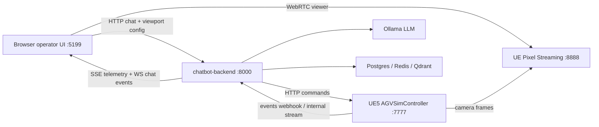

# ARCHITECTURE.md

## System Overview

The Virtual Process system is a UE5-backed digital-twin operator stack. The
backend turns natural-language requests into validated AGV and simulation
commands, sends those commands to the UE5 cell, receives UE progress events, and
streams operational state back to the browser.

The browser page at `http://localhost:5199` is now a real operator surface: the
main scene is the configured UE5 Pixel Streaming camera view, while chat,
metrics, workload progress, and zone controls are rendered as web overlays.

## Enterprise Boundaries

### 1. Browser Operator UI (`chat-web`)

Responsibilities:

- Render the UE5 camera view from `GET /unreal/viewport`.
- Subscribe to `GET /unreal/telemetry/stream` using SSE for live KPIs.
- Manage chat sessions and receive session-scoped events.
- Send zone-focus and chat commands without directly coupling to UE actor state.

Key interfaces:

- `GET /unreal/viewport`
- `GET /unreal/telemetry/stream`
- `POST /chat/sessions`
- `POST /chat/messages`
- `WS /chat/sessions/{session_id}/events`

### 2. Chatbot Backend (`chatbot-backend`)

Responsibilities:

- Session, message, command, and event orchestration.
- LangGraph request routing and LLM/tool-call planning.
- UE5 command adapter over HTTP (`Ue5CommandClient`).
- UE5 progress ingest over HTTP webhook or internal WebSocket.
- Data-oriented DTO boundaries for telemetry, viewport config, commands, and
  domain events.

Internal layers:

- `interfaces`
- `application`
- `domain`
- `agents`
- `tools`
- `infrastructure`

### 3. UE5 AGV Cell (`AGVSimController`)

Responsibilities:

- Own simulation lifecycle and runtime actor orchestration.
- Expose local HTTP control routes on `:7777`.
- Emit chat-correlated progress/completion events to the backend.
- Provide `GET /sim/status` as compact `ProcessTelemetry`, not actor graphs.
- Provide the camera feed through UE Pixel Streaming outside the HTTP command
  API.

### 4. Supporting Services

- `control-server-demo`: station registry mock used by planning/status flows.
- `postgres`: durable sessions, messages, commands, and events when enabled.
- `redis`, `qdrant`, `timescaledb`: optional demo infrastructure.
- `ollama`: local Gemma model runtime.

## Communication Protocols

| Direction | Protocol | Purpose |
|---|---|---|
| Browser -> backend | HTTP | Chat, sessions, viewport metadata, zone focus |
| Backend -> browser | SSE | Live UE process telemetry |
| Backend -> browser | WebSocket | Session-scoped chat/domain events |
| Backend -> UE5 | HTTP | Simulation and AGV commands |
| UE5 -> backend | HTTP webhook / internal WebSocket | Chat-correlated progress and completion |
| UE5 -> browser | Pixel Streaming WebRTC | Camera view / interactive UE viewport |

## Logical Architecture

