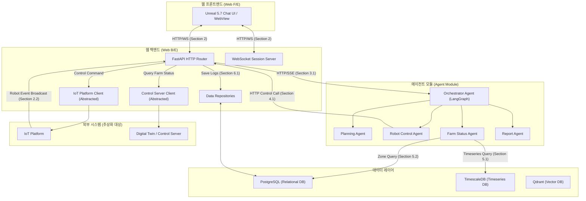
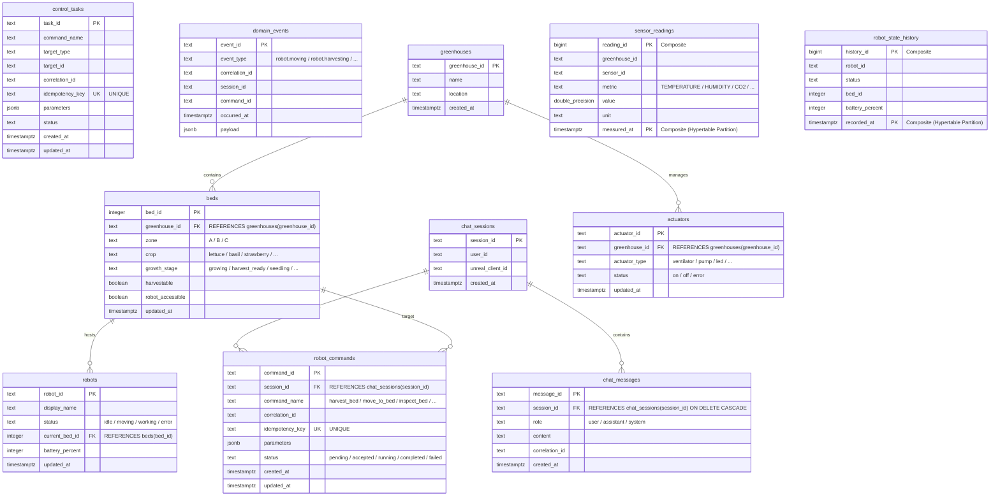

# 스마트팜 디지털트윈 챗봇 시스템 인터페이스 설계서 및 데이터베이스 설계서 (v1.0)

본 설계서는 스마트팜 디지털트윈 챗봇 데모 시스템의 **웹 프론트엔드(Web Front-End)**, **웹 백엔드(Web Back-End)**, **에이전트 모듈(Agent Module)** 간의 인터페이스 설계 및 **데이터베이스 ERD 다이어그램/상세 스펙**을 정의합니다.

> [!IMPORTANT]
> **외부 모듈(IoT 플랫폼, DT 서버 등)**은 현재 개발 상황을 고려하여 추상화된 경계로 취급하며, 챗봇 백엔드의 아웃바운드 어댑터(Client/Adapter) 형태로 인터페이스 규격만 정의합니다.

---

## 1. 시스템 아키텍처 개요 및 모듈 구성

챗봇 시스템은 사용자의 자연어 입력을 받아 디지털트윈 환경(Unreal Engine)의 상태를 분석하고, 하드웨어 제어(로봇 등) 명령을 안전하게 발행한 후, 실행 진행률 및 최종 결과를 실시간으로 보고하는 오케스트레이션 시스템입니다.



### 모듈별 핵심 역할
1. **웹 프론트엔드 (Web Front-End)**
   - Unreal Engine 5.7 내부의 WebBrowser 컴포넌트(WebView)를 통해 작동하며, 챗봇 대화 인터페이스를 사용자에게 제공합니다.
   - 백엔드와 실시간 양방향 WebSocket 통신을 통해 AI 추론 단계, 제어 진행률 상태 인디케이터, 로봇 이동/수확 등 외부 비동기 이벤트를 동적으로 수신하고 렌더링합니다.
2. **웹 백엔드 (Web Back-End)**
   - API 게이트웨이 역할을 수행하며 세션 라이프사이클 및 대화 내역 영구 저장을 담당합니다.
   - 에이전트 모듈로의 추론 요청 전달, 로봇 제어 명령 위임 수신(Tool Execution Proxy), 외부 IoT/DT 시스템의 API 호출 추상화 및 비동기 결과(이벤트)를 수집하여 WebSocket 클라이언트로 라우팅합니다.
3. **에이전트 모듈 (Agent Module)**
   - 사용자의 자연어를 분석하여 시나리오 단계별 계획(Plan)을 생성하고 하드웨어 제어 여부를 판단(Tool Calling)합니다.
   - 로봇 제어가 필요한 경우 웹 백엔드의 제어 위임 API를 호출하고, 상태 확인이 필요한 경우 DB 서버(TimescaleDB/PostgreSQL)에 직접 쿼리하여 상황을 인지한 후 결과를 오케스트레이션합니다.

---

## 2. 공통 사항 및 메시지 규격

### 2.1 Base URL
| 모듈명 | 물리 주소 (예시) | 비고 |
| :--- | :--- | :--- |
| **Web B/E** | `https://chatbot.example.com/api` | REST API 기본 경로 |
| **Web B/E (WS)** | `wss://chatbot.example.com/ws` | WebSocket 연결 기본 경로 |
| **AI Agent** | `https://agent.example.com` | GPU 팜 및 에이전트 추론 서버 |
| **DB Server** | `https://db.example.com/api` | 데이터베이스 원격 API 래핑 서버 |

### 2.2 공통 메시지 헤더 (Traceability 보장)
모든 REST 응답 및 WebSocket 프레임의 최상위에는 메시지 추적(Traceability)을 위한 공통 `header` 객체가 필수로 포함됩니다.

```json
{
  "header": {
    "msg_id": "req-sess-001",
    "timestamp": "2026-05-19T12:00:00Z",
    "sender_id": "WEB_FE",
    "receiver_id": "WEB_BE"
  }
}
```
* **sender_id / receiver_id 허용 정의값**: `WEB_FE`, `WEB_BE`, `AI_AGENT`, `DB_SERVER`

### 2.3 공통 에러 응답 구조 (HTTP 4xx / 5xx)
```json
{
  "error": {
    "code": "SESSION_NOT_FOUND",
    "message": "요청하신 세션이 존재하지 않거나 만료되었습니다.",
    "details": {
      "session_id": "sess-abc123"
    }
  }
}
```

---

## 3. 인터페이스 명세서

### 3.1 웹 프론트엔드 (Web F/E) ↔ 웹 백엔드 (Web B/E) 인터페이스

#### ① 세션 생성 (POST `/chat/sessions`)
챗봇 UI가 활성화될 때 실시간 소켓 바인딩을 위한 전제 조건으로 세션을 선 생성하고 세션 ID를 발급받습니다.

- **Request Body**
  ```json
  {
    "header": {
      "msg_id": "req-sess-001",
      "timestamp": "2026-05-19T12:00:00.000Z",
      "sender_id": "WEB_FE",
      "receiver_id": "WEB_BE"
    }
  }
  ```
- **Response Body (201 Created)**
  ```json
  {
    "header": {
      "msg_id": "res-sess-001",
      "timestamp": "2026-05-19T12:00:01.000Z",
      "sender_id": "WEB_BE",
      "receiver_id": "WEB_FE"
    },
    "session_id": "sess_231cc306f7684e4bb9b242a761913c65",
    "created_at": "2026-05-19T12:00:01.000Z"
  }
  ```

#### ② 실시간 양방향 채팅 및 스트리밍 (WS `/ws/chat?session_id={session_id}`)
사용자 자연어 입력 메시지 수신 및 AI의 단어별 토큰 스트리밍, 하드웨어 제어 중 상태 표기를 위한 실시간 웹소켓 채널입니다.

- **이벤트 타입 정의**
  | event_type | 방향 | 설명 |
  | :--- | :--- | :--- |
  | `connection_ack` | Server → Client | WebSocket 연결 수립 및 세션 바인딩 확인 |
  | `text_stream` | Server → Client | AI 모델 응답 토큰 스트리밍 (프론트에서 누적 렌더링) |
  | `tool_call` | Server → Client | 하드웨어 물리 제어가 시작되었음을 알리는 인디케이터 트리거 |
  | `text_done` | Server → Client | 제어 완료 및 피드백이 최종 반영된 종합 답변 완료 보고 |
  | *(User Message)* | Client → Server | 사용자가 입력한 자연어 메시지 전송 |

- **이벤트별 JSON 프레임 상세**
  
  **[Server → Client] connection_ack**
  ```json
  {
    "header": { "msg_id": "sys-ack-001", "timestamp": "2026-05-19T12:00:02Z", "sender_id": "WEB_BE", "receiver_id": "WEB_FE" },
    "event_type": "connection_ack",
    "session_id": "sess_abc123"
  }
  ```

  **[Client → Server] 사용자 자연어 입력**
  ```json
  {
    "header": { "msg_id": "chat-fe-101", "timestamp": "2026-05-19T12:00:10Z", "sender_id": "WEB_FE", "receiver_id": "WEB_BE" },
    "session_id": "sess_abc123",
    "message": {
      "role": "user",
      "content": "2번 bed의 식물을 수확해줘."
    }
  }
  ```

  **[Server → Client] text_stream (응답 토큰 단위 전달)**
  ```json
  {
    "header": { "msg_id": "chat-be-201", "timestamp": "2026-05-19T12:00:11Z", "sender_id": "WEB_BE", "receiver_id": "WEB_FE" },
    "session_id": "sess_abc123",
    "event_type": "text_stream",
    "message": {
      "role": "assistant",
      "content": "2번 구역의 작물 수확 명령을 분석 중입니다... "
    }
  }
  ```

  **[Server → Client] tool_call (제어 실행 중 알림)**
  ```json
  {
    "header": { "msg_id": "chat-be-202", "timestamp": "2026-05-19T12:00:13Z", "sender_id": "WEB_BE", "receiver_id": "WEB_FE" },
    "session_id": "sess_abc123",
    "event_type": "tool_call",
    "message": {
      "role": "assistant",
      "content": "[시스템 동작] 물리 장비 제어 및 데이터 동기화 진행 중..."
    }
  }
  ```

  **[Server → Client] text_done (최종 보고 및 대화 완료)**
  ```json
  {
    "header": { "msg_id": "chat-be-203", "timestamp": "2026-05-19T12:01:05Z", "sender_id": "WEB_BE", "receiver_id": "WEB_FE" },
    "session_id": "sess_abc123",
    "event_type": "text_done",
    "message": {
      "role": "assistant",
      "content": "2번 bed 수확 로봇(AMR_1) 제어가 완료되었습니다. 현재 총 수확량은 35개입니다."
    }
  }
  ```

#### ③ 과거 대화 이력 조회 (GET `/chat/sessions/{session_id}/messages`)
특정 대화 세션 내에서 오고 간 누적 대화 기록을 역순으로 조회하여 채팅창 재활성화 시 복원합니다.

- **Query Parameters**
  - `limit` (Optional, Integer): 반환할 최대 대화 턴 수 (Default: 50)
  - `since` (Optional, String): 특정 시각 이후의 데이터 필터링 (ISO8601 형식)

- **Response Body (200 OK)**
  ```json
  {
    "header": { "msg_id": "res-hist-001", "timestamp": "2026-05-19T12:05:00Z", "sender_id": "WEB_BE", "receiver_id": "WEB_FE" },
    "session_id": "sess_abc123",
    "items": [
      {
        "message_id": "msg_001",
        "role": "user",
        "content": "2번 bed의 식물을 수확해줘.",
        "timestamp": "2026-05-19T12:00:10Z"
      },
      {
        "message_id": "msg_002",
        "role": "assistant",
        "content": "2번 bed 수확 로봇(AMR_1) 제어가 완료되었습니다. 현재 총 수확량은 35개입니다.",
        "timestamp": "2026-05-19T12:01:05Z"
      }
    ]
  }
  ```

---

### 3.2 웹 백엔드 (Web B/E) ↔ 에이전트 모듈 (Agent Module) 인터페이스

#### ① 에이전트 추론 요청 (POST `/ai-agent/inference/chat`)
웹 백엔드가 사용자의 자연어 입력값과 대화 세션 컨텍스트를 종합하여 에이전트(LLM 오케스트레이터)에게 추론을 요청하고, SSE 스트림으로 결과를 전달받습니다.

- **Request Body**
  ```json
  {
    "header": {
      "msg_id": "infer-req-001",
      "timestamp": "2026-05-19T12:00:10Z",
      "sender_id": "WEB_BE",
      "receiver_id": "AI_AGENT"
    },
    "session_id": "sess_abc123",
    "message": {
      "role": "user",
      "content": "2번 bed의 식물을 수확해줘."
    },
    "context": {
      "scenario_id": "S3001",
      "scenario_step": "STEP_2",
      "active_zone": "ZONE_1"
    },
    "history": [
      { "role": "user", "content": "작업 시작할게." },
      { "role": "assistant", "content": "시나리오를 시작합니다. 제어할 구역을 알려주세요." }
    ]
  }
  ```

- **Response (SSE Stream - Content-Type: `text/event-stream`)**
  에이전트는 작업 처리 과정에 따라 아래 3가지 유형의 이벤트를 순차적으로 출력합니다.

  ```http
  id: 1
  event: token
  data: {"session_id": "sess_abc123", "delta": "2번 구역의 작물 수확 명령을 분석 중입니다... ", "is_final": false}

  id: 2
  event: tool_call
  data: {"session_id": "sess_abc123", "tool_name": "control_hardware", "tool_status": "invoking"}

  id: 3
  event: done
  data: {"session_id": "sess_abc123", "delta": "2번 bed 수확 로봇(AMR_1) 제어가 성공적으로 완료되었습니다.", "is_final": true}
  ```

---

### 3.3 에이전트 모듈 ↔ 웹 백엔드 / DB 서버 인터페이스 [Tool Calling]

#### ① 물리 제어 명령 위임 (POST `/ai-agent/control/execute`)
에이전트가 사용자 입력 분석 결과 물리적 로봇 제어가 필요하다고 판단한 경우, 웹 백엔드로 실제 IoT 명령 전송을 제어 위임하는 툴 API입니다.

- **Request Body (AI Agent → Web B/E)**
  ```json
  {
    "header": {
      "msg_id": "tool-ctrl-001",
      "timestamp": "2026-05-19T12:00:15Z",
      "sender_id": "AI_AGENT",
      "receiver_id": "WEB_BE"
    },
    "session_id": "sess_abc123",
    "control_type": "HARVEST",
    "target_zone": "ZONE_1",
    "params": {
      "robot_id": "AMR_1",
      "action": "START_HARVEST",
      "bed_id": 2
    }
  }
  ```

- **Response Body (200 OK) (Web B/E → AI Agent)**
  웹 백엔드는 외부 IoT 플랫폼으로 명령을 발행한 뒤 동기식으로 피드백을 수신하여 에이전트에 최종 결과를 반환합니다.
  ```json
  {
    "header": {
      "msg_id": "tool-ctrl-res-001",
      "timestamp": "2026-05-19T12:01:03Z",
      "sender_id": "WEB_BE",
      "receiver_id": "AI_AGENT"
    },
    "status": "COMPLETED",
    "dt_response": {
      "scenario_id": "S3001",
      "message": "Zone 1 수확 로봇 제어가 성공적으로 완료되었습니다.",
      "feedback_data": {
        "current_harvest": 35,
        "device_status": "IDLE"
      }
    }
  }
  ```

- **허용 `control_type` 및 Parameters 정의**
  - **`HARVEST`**: 수확 로봇 작동 위임. 필수 params: `bed_id` (Integer), `robot_id` (String)
  - **`MOVE`**: 로봇 이동. 필수 params: `bed_id` (Integer), `robot_id` (String)
  - **`INSPECT`**: 병해충 및 환경 점검. 필수 params: `bed_id` (Integer)
  - **`CANCEL`**: 명령 취소. 필수 params: `command_id` (String)

---

#### ② 시계열 센서 데이터 조회 (GET `/ai-agent/data/sensor`)
에이전트(Data Agent)가 스마트팜 환경 분석을 수행하기 위해 시계열 DB(TimescaleDB)에서 직접 센서 원격 데이터를 스냅샷 형태로 질의하는 API입니다.

- **Query Parameters**
  - `zone` (Required, String): 조회 대상 스마트팜 구역 (예: `ZONE_1`)
  - `metric` (Required, String): 조회 대상 물리량 (`TEMPERATURE` | `HUMIDITY` | `ILLUMINANCE` | `NUTRIENT`)
  - `from` (Required, String): 조회 시작 시간 범위 (ISO8601 UTC)
  - `to` (Required, String): 조회 종료 시간 범위 (ISO8601 UTC)
  - `limit` (Optional, Integer): 최대 레코드 반환 개수 제한

- **Response Body (200 OK)**
  ```json
  {
    "header": {
      "msg_id": "db-sensor-001",
      "timestamp": "2026-05-19T12:00:20Z",
      "sender_id": "DB_SERVER",
      "receiver_id": "AI_AGENT"
    },
    "zone": "ZONE_1",
    "metric": "TEMPERATURE",
    "items": [
      {
        "hw_id": "Z1_TEMP_SENSOR_01",
        "value": 22.5,
        "unit": "℃",
        "timestamp": "2026-05-19T11:59:58Z"
      }
    ]
  }
  ```

---

#### ③ 구역 요약 운영지표 조회 (GET `/zone-summary/{zone_id}`)
에이전트가 현재 재배 구역의 운영 현황(재배 베드 개수, 현재 수확량, 목표 수확량 등)의 집계 정보를 Postgres 관계형 데이터베이스에서 조회할 때 사용합니다.

- **Response Body (200 OK)**
  ```json
  {
    "header": {
      "msg_id": "db-summary-001",
      "timestamp": "2026-05-19T12:00:22Z",
      "sender_id": "DB_SERVER",
      "receiver_id": "AI_AGENT"
    },
    "zone_id": "ZONE_1",
    "summary": {
      "crop_port_count": 120,
      "current_harvest": 35,
      "target_harvest": 50,
      "anomaly_count": 1
    },
    "generated_at": "2026-05-19T12:00:22Z"
  }
  ```

---

### 3.4 웹 백엔드 ↔ DB 서버 인터페이스 [채팅 로그 영구화]

#### ① 채팅 로그 영구 저장 (POST `/data/chat-logs`)
웹 백엔드가 일련의 메시지 교환(사용자 입력 - AI 최종 출력 턴)이 완료되는 시점에 대화 세션 데이터를 안정적으로 관계형 데이터베이스에 영구히 저장하기 위해 요청합니다.

- **Request Body**
  ```json
  {
    "header": {
      "msg_id": "log-save-001",
      "timestamp": "2026-05-19T12:01:10Z",
      "sender_id": "WEB_BE",
      "receiver_id": "DB_SERVER"
    },
    "session_id": "sess_abc123",
    "messages": [
      {
        "message_id": "msg-101",
        "role": "user",
        "content": "2번 bed의 식물을 수확해줘.",
        "timestamp": "2026-05-19T12:00:10Z"
      },
      {
        "message_id": "msg-102",
        "role": "assistant",
        "content": "2번 bed 수확 로봇(AMR_1) 제어가 완료되었습니다. 현재 총 수확량은 35개입니다.",
        "timestamp": "2026-05-19T12:01:05Z"
      }
    ]
  }
  ```

- **Response Body (200 OK)**
  ```json
  {
    "header": {
      "msg_id": "log-save-res-001",
      "timestamp": "2026-05-19T12:01:11Z",
      "sender_id": "DB_SERVER",
      "receiver_id": "WEB_BE"
    },
    "status": "SAVED",
    "saved_count": 2
  }
  ```

---

### 3.5 아웃바운드 외부 모듈 (IoT 플랫폼 / DT 서버) 연동 규격 [추상화]

> [!WARNING]
> 외부 모듈 인터페이스는 현 단계에서 아키텍처 결합도를 낮추기 위해 웹 백엔드의 어댑터 클래스(`HttpIotCommandClient`, `HttpControlServerClient`) 내부에서 Mocking 및 기본 REST 통신 모델로 추상화하여 구현되어 있습니다.

#### ① 로봇 명령 전송 (POST `/robots/commands` - IoT 플랫폼)
웹 백엔드에서 생성된 고유 식별자(`command_id`, `correlation_id`, `idempotency_key`)를 동봉하여 비동기 하드웨어 제어를 전송합니다.

- **Request Payload**
  ```json
  {
    "command_id": "cmd_harvest_002",
    "session_id": "sess_abc123",
    "command_name": "harvest_bed",
    "correlation_id": "corr_web_231cc306f7684e4bb9b242a761913c65",
    "idempotency_key": "chat-web-corr_web_231cc306f7684e4bb9b242a761913c65",
    "parameters": { "bed_id": 2 }
  }
  ```
- **Response Payload**
  ```json
  {
    "command_id": "cmd_harvest_002",
    "status": "accepted"
  }
  ```

#### ② 로봇 명령 완료 이벤트 콜백 수신 (POST `/events/robot-command` - Web B/E 수신)
IoT 플랫폼에서 로봇 제어가 완료(`completed`)되거나 실패(`failed`)했을 때 백엔드에 완료 트랜잭션을 전파합니다.
- **Request Payload (IoT Platform → Web B/E)**
  ```json
  {
    "event_type": "robot.command.completed",
    "correlation_id": "corr_web_231cc306f7684e4bb9b242a761913c65",
    "session_id": "sess_abc123",
    "command_id": "cmd_harvest_002",
    "payload": {
      "robot_id": "AMR_1",
      "bed_id": 2,
      "progress": 1.0,
      "reason": ""
    }
  }
  ```

---

## 4. 데이터베이스 ERD 다이어그램

챗봇 시스템 및 시나리오 지원에 사용되는 데이터베이스 스키마는 **PostgreSQL 관계형 영역**과 **TimescaleDB 시계열/원격검침 영역**으로 이원화하여 설계되었습니다.



---

## 5. 데이터베이스 테이블 상세 명세서

### 5.1 PostgreSQL (Relational DB - `pai_chatbot`)

#### ① `chat_sessions` (채팅 대화 세션)
사용자 및 Unreal 클라이언트 접속에 따른 챗 세션을 관리합니다.
| 물리 컬럼명 | 데이터 타입 | 제약 조건 | 설명 |
| :--- | :--- | :--- | :--- |
| `session_id` | TEXT | PRIMARY KEY | 세션의 고유 식별자 (예: `session_...`) |
| `user_id` | TEXT | NULLABLE | 사용자(오퍼레이터) 고유 식별 ID |
| `unreal_client_id` | TEXT | NULLABLE | Unreal Engine 5.7 실행 클라이언트 ID |
| `created_at` | TIMESTAMPTZ | NOT NULL, DEFAULT now() | 세션 생성 일시 |

#### ② `chat_messages` (채팅 메시지 개별 내역)
세션에 속한 개별 대화 발화(턴)를 저장합니다.
| 물리 컬럼명 | 데이터 타입 | 제약 조건 | 설명 |
| :--- | :--- | :--- | :--- |
| `message_id` | TEXT | PRIMARY KEY | 개별 메시지 고유 식별자 (예: `msg_...`) |
| `session_id` | TEXT | NOT NULL, REFERENCES `chat_sessions` | 소속된 세션 ID (ON DELETE CASCADE) |
| `role` | TEXT | NOT NULL | 발화 주체 (`user` / `assistant` / `system`) |
| `content` | TEXT | NOT NULL | 자연어 대화 텍스트 내용 |
| `correlation_id` | TEXT | NOT NULL | 추적용 ID |
| `created_at` | TIMESTAMPTZ | NOT NULL, DEFAULT now() | 메시지 전송 일시 |
* **추가 인덱스**: `idx_chat_messages_session_created_at (session_id, created_at ASC)`

#### ③ `robot_commands` (로봇 제어 명령 이력)
챗봇 에이전트에 의해 의도된 로봇 물리 조작 명령의 발생과 진행 단계를 기록합니다.
| 물리 컬럼명 | 데이터 타입 | 제약 조건 | 설명 |
| :--- | :--- | :--- | :--- |
| `command_id` | TEXT | PRIMARY KEY | 로봇 명령 고유 ID (예: `cmd_...`) |
| `session_id` | TEXT | REFERENCES `chat_sessions` | 해당 명령을 트리거한 대화 세션 ID |
| `command_name` | TEXT | NOT NULL | 명령 유형 (`harvest_bed`, `move_to_bed` 등) |
| `correlation_id` | TEXT | NOT NULL | 트랜잭션 상관관계 추적용 고유 키 |
| `idempotency_key`| TEXT | NOT NULL, UNIQUE | 중복 발행 방지용 멱등성 키 |
| `parameters` | JSONB | NOT NULL, DEFAULT '{}' | 명령 실행 인자 (예: `{"bed_id": 2}`) |
| `status` | TEXT | NOT NULL | 명령 진행 상태 (`pending`, `accepted`, `completed` 등) |
| `created_at` | TIMESTAMPTZ | NOT NULL, DEFAULT now() | 명령 최초 발행 시각 |
| `updated_at` | TIMESTAMPTZ | NOT NULL, DEFAULT now() | 최종 갱신 일시 |

#### ④ `greenhouses` (스마트팜 온실 물리 정보)
| 물리 컬럼명 | 데이터 타입 | 제약 조건 | 설명 |
| :--- | :--- | :--- | :--- |
| `greenhouse_id` | TEXT | PRIMARY KEY | 온실 고유 번호 |
| `name` | TEXT | NOT NULL | 온실 식별 명칭 |
| `location` | TEXT | NOT NULL | 온실 상세 위치 |
| `created_at` | TIMESTAMPTZ | NOT NULL, DEFAULT now() | 등록일 |

#### ⑤ `beds` (재배 베드 현황)
수확 대상 및 로봇이 이동할 목적지인 베드의 현 상태입니다.
| 물리 컬럼명 | 데이터 타입 | 제약 조건 | 설명 |
| :--- | :--- | :--- | :--- |
| `bed_id` | INTEGER | PRIMARY KEY | 베드 고유 일련번호 |
| `greenhouse_id` | TEXT | NOT NULL, REFERENCES `greenhouses` | 베드가 위치한 소속 온실 ID |
| `zone` | TEXT | NOT NULL | 구역 구분 코드 (예: `A`, `B`, `ZONE_1`) |
| `crop` | TEXT | NOT NULL | 재배 중인 식물 품종 명칭 (예: `lettuce`) |
| `growth_stage` | TEXT | NOT NULL | 생육 현 단계 (예: `harvest_ready`, `growing`) |
| `harvestable` | BOOLEAN | NOT NULL, DEFAULT FALSE | 수확 적기 상태 충족 여부 |
| `robot_accessible`| BOOLEAN | NOT NULL, DEFAULT TRUE | 로봇 이동 및 작업 가능 구역 여부 |
| `updated_at` | TIMESTAMPTZ | NOT NULL, DEFAULT now() | 최근 상태 갱신 일자 |

#### ⑥ `robots` (로봇 정보 및 상태)
| 물리 컬럼명 | 데이터 타입 | 제약 조건 | 설명 |
| :--- | :--- | :--- | :--- |
| `robot_id` | TEXT | PRIMARY KEY | 로봇 고유 시리얼 코드 (예: `AMR_1`) |
| `display_name` | TEXT | NOT NULL | 로봇 노출 명칭 |
| `status` | TEXT | NOT NULL | 현재 작업 상태 (`idle`, `moving`, `working` 등) |
| `current_bed_id` | INTEGER | REFERENCES `beds` | 현재 로봇이 정차/작업 중인 베드 ID |
| `battery_percent` | INTEGER | NOT NULL, CHECK (0~100) | 로봇 배터리 잔여 용량 |
| `updated_at` | TIMESTAMPTZ | NOT NULL, DEFAULT now() | 최종 하트비트/갱신 일시 |

---

### 5.2 TimescaleDB (Timeseries DB - `pai_timeseries`)

시계열 테이블은 데이터 저장 효율성을 높이기 위해 `measured_at` 또는 `recorded_at` 타임스탬프를 파티셔닝 키로 설정하여 `hypertable` 구조로 구동됩니다.

#### ① `sensor_readings` (환경 센서 실시간 계측 데이터)
| 물리 컬럼명 | 데이터 타입 | 제약 조건 | 설명 |
| :--- | :--- | :--- | :--- |
| `reading_id` | BIGINT | GENERATED BY DEFAULT AS IDENTITY | 단독 인서트 인덱스 (Composite PK) |
| `greenhouse_id` | TEXT | NOT NULL | 측정 위치 온실 ID |
| `sensor_id` | TEXT | NOT NULL | 계측 기기 센서 ID (예: `Z1_TEMP_SENSOR_01`) |
| `metric` | TEXT | NOT NULL | 물리량 종류 (`TEMPERATURE`, `HUMIDITY` 등) |
| `value` | DOUBLE PRECISION| NOT NULL | 측정 센서 값 |
| `unit` | TEXT | NOT NULL | 계측 물리 단위 (예: `℃`, `%`, `ppm`, `lux`) |
| `measured_at` | TIMESTAMPTZ | NOT NULL | 센서 측정 기록 기준 시간 (Composite PK) |
* **하이퍼테이블 셋업**: `SELECT create_hypertable('sensor_readings', 'measured_at');`
* **추가 인덱스**: `idx_sensor_readings_metric_time (metric, measured_at DESC)`

#### ② `robot_state_history` (로봇 물리 궤적 및 배터리 전력 로깅)
| 물리 컬럼명 | 데이터 타입 | 제약 조건 | 설명 |
| :--- | :--- | :--- | :--- |
| `history_id` | BIGINT | GENERATED BY DEFAULT AS IDENTITY | 이력 인덱스 (Composite PK) |
| `robot_id` | TEXT | NOT NULL | 대상 로봇 식별자 |
| `status` | TEXT | NOT NULL | 측정 시점의 로봇 실행 상태 |
| `bed_id` | INTEGER | NULLABLE | 측정 시점 위치한 베드 ID |
| `battery_percent` | INTEGER | NOT NULL, CHECK (0~100) | 배터리 용량 지표 |
| `recorded_at` | TIMESTAMPTZ | NOT NULL | 상태 기록 기준 시간 (Composite PK) |
* **하이퍼테이블 셋업**: `SELECT create_hypertable('robot_state_history', 'recorded_at');`
* **추가 인덱스**: `idx_robot_state_history_robot_time (robot_id, recorded_at DESC)`

---

## 6. 미결 및 향후 고려 사항

1. **상태 피드백 동기화 타임아웃**
   - 로봇 제어 명령(`POST /ai-agent/control/execute`) 발행 후 실제 하드웨어가 동작하여 완료되기까지 수십 초가 소요될 수 있습니다.
   - 현재 데모에서는 HTTP 연결을 유지하는 동기식 피드백 모델을 채택하고 있으나, 실 환경 도입 시 비동기 큐잉(RabbitMQ/Redis Stream) 및 웹소켓 알림 모델로의 전환이 필요합니다.
2. **에이전트 모듈 통신 구조 고도화**
   - 현재 프로젝트 내부 코드에서는 LangGraph 에이전트 인스턴스가 인프로세스(In-process) 라이브러리 형태로 탑재되어 있으나, GPU 팜 스케일아웃 시 별도의 HTTP/REST 및 SSE 엔드포인트(`POST /ai-agent/inference/chat`)로 분리될 수 있으므로, 웹 백엔드에는 Gateway 패턴을 통한 API 라우팅 레이어를 사전 배치하였습니다.
3. **TimescaleDB 시계열 보관 주기 (Retention Policy)**
   - 대량의 시계열 센서 계측 데이터 수집 시 인프라 용량 관리를 위해, 데모 이후 30일 경과 데이터는 압축(Compression) 및 90일 경과 데이터는 자동 삭제(Drop Chunk) 정책의 수립이 추가로 필요합니다.
