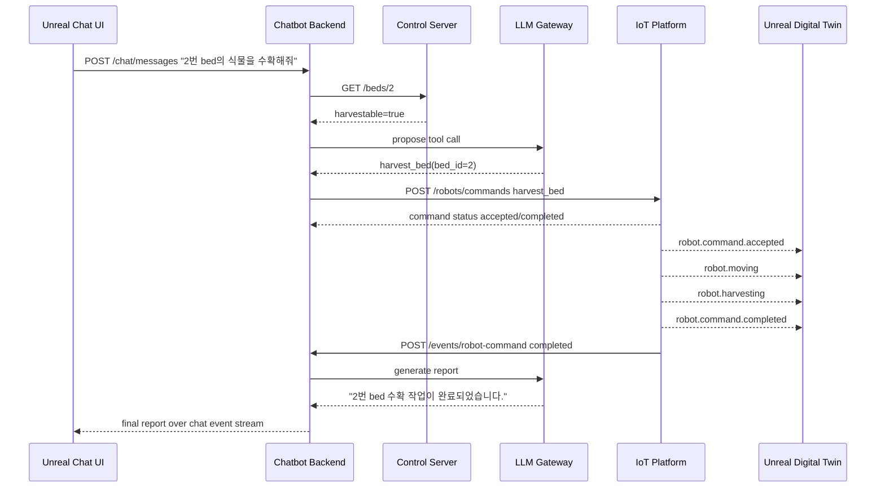

# Sequence: Harvest Bed 2

```mermaid
sequenceDiagram
  participant UE as Unreal Chat UI
  participant Chat as Chatbot Backend
  participant Control as Control Server
  participant LLM as LLM Gateway
  participant IoT as IoT Platform
  participant Twin as Unreal Digital Twin

  UE->>Chat: POST /chat/messages "2번 bed의 식물을 수확해줘"
  Chat->>Control: GET /beds/2
  Control-->>Chat: harvestable=true
  Chat->>LLM: propose tool call
  LLM-->>Chat: harvest_bed(bed_id=2)
  Chat->>IoT: POST /robots/commands harvest_bed
  IoT-->>Chat: command status accepted/completed
  IoT-->>Twin: robot.command.accepted
  IoT-->>Twin: robot.moving
  IoT-->>Twin: robot.harvesting
  IoT-->>Twin: robot.command.completed
  IoT->>Chat: POST /events/robot-command completed
  Chat->>LLM: generate report
  LLM-->>Chat: "2번 bed 수확 작업이 완료되었습니다."
  Chat-->>UE: final report over chat event stream
```
