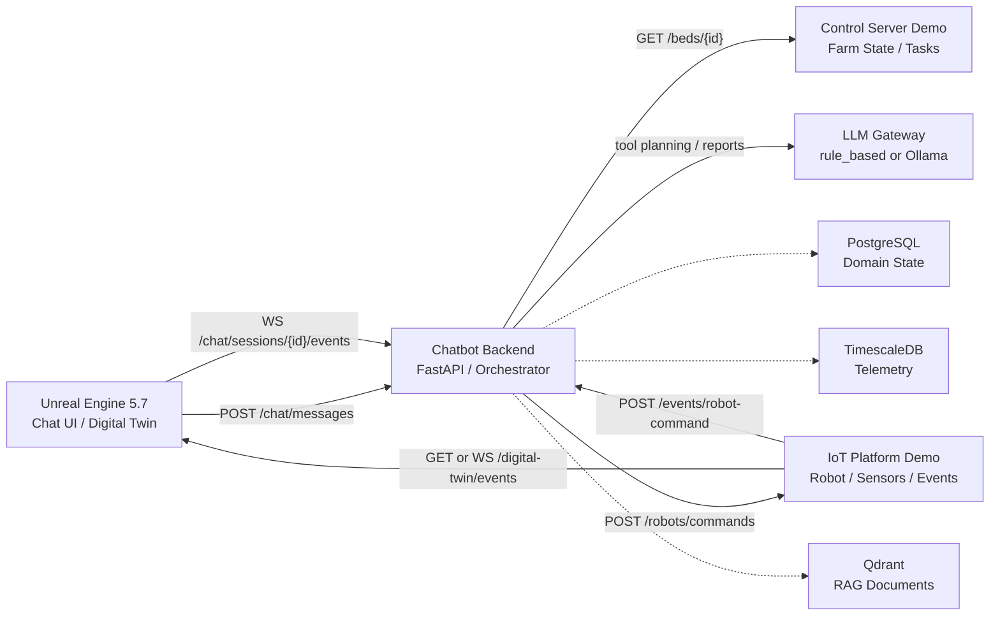

# System Context

```mermaid
flowchart LR
  UE["Unreal Engine 5.7<br/>Chat UI / Digital Twin"]
  Chat["Chatbot Backend<br/>FastAPI / Orchestrator"]
  Control["Control Server Demo<br/>Farm State / Tasks"]
  IoT["IoT Platform Demo<br/>Robot / Sensors / Events"]
  DB["PostgreSQL<br/>Domain State"]
  TS["TimescaleDB<br/>Telemetry"]
  VDB["Qdrant<br/>RAG Documents"]
  LLM["LLM Gateway<br/>rule_based or Ollama"]

  UE -->|"POST /chat/messages"| Chat
  UE -->|"WS /chat/sessions/{id}/events"| Chat
  Chat -->|"GET /beds/{id}"| Control
  Chat -->|"tool planning / reports"| LLM
  Chat -->|"POST /robots/commands"| IoT
  IoT -->|"GET or WS /digital-twin/events"| UE
  IoT -->|"POST /events/robot-command"| Chat
  Chat -.-> DB
  Chat -.-> TS
  Chat -.-> VDB
```
